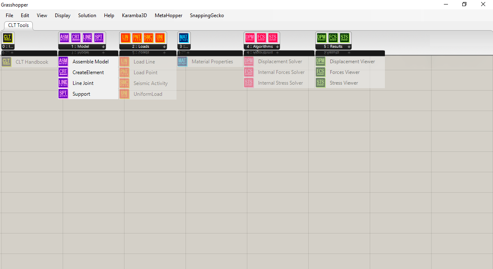
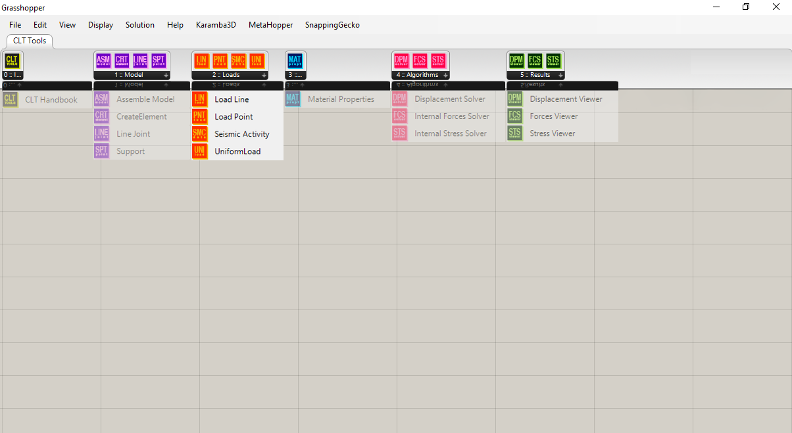
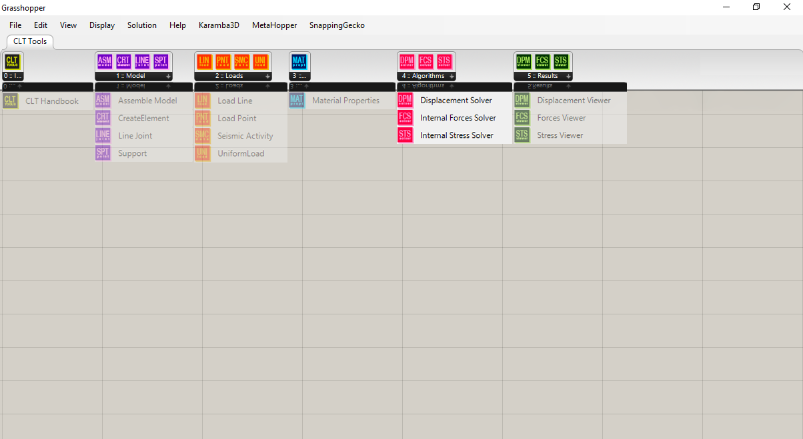
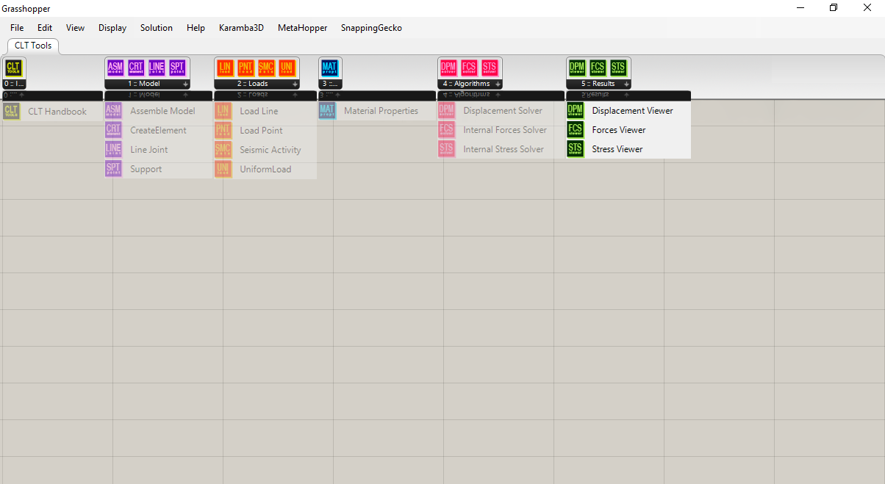
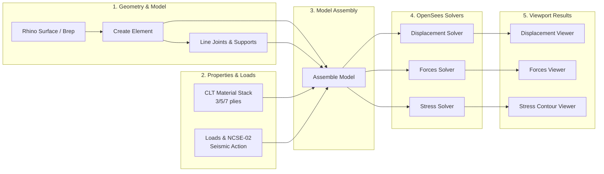
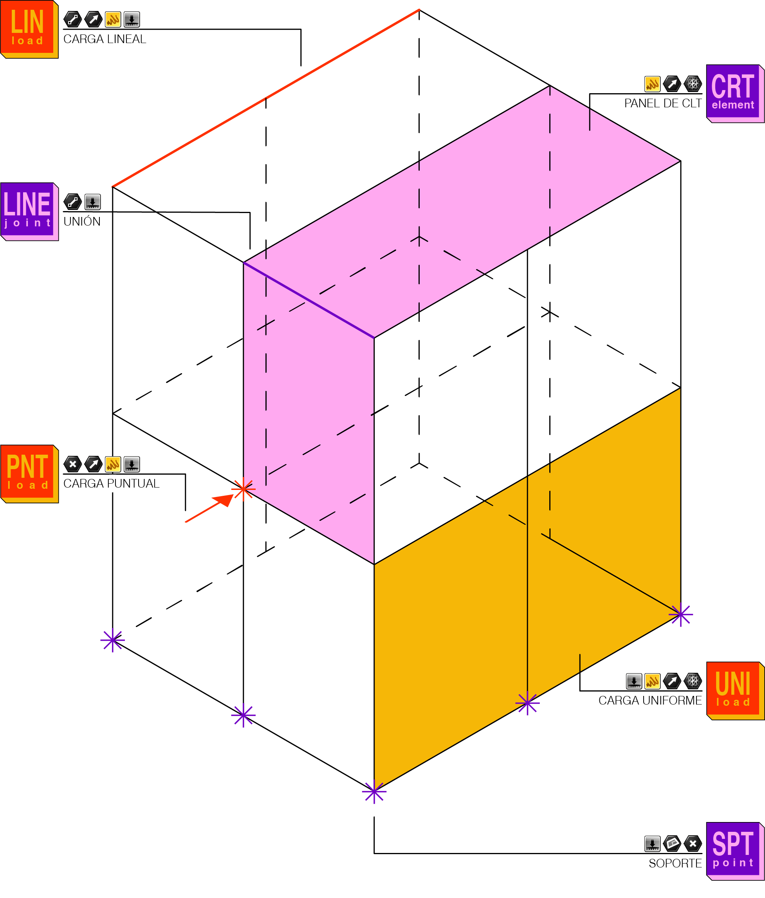

# CLT Tools

<p align="center">
  
</p>

<p align="center">
  <strong>Parametric Structural Analysis of Cross-Laminated Timber (CLT) for Grasshopper & OpenSees</strong>
</p>

<p align="center">
  
  
  
  
  
</p>

---

## Overview

**CLT Tools** is a parametric Finite Element Analysis (FEA) plugin for **Rhinoceros 3D** and **Grasshopper**, developed on top of the **OpenSees** structural framework. It is specifically tailored for structural engineering and architectural design with **Cross-Laminated Timber (CLT / Madera Contralaminada)**.


Developed as a Master's Thesis (TFM) research project in the **Máster Universitario en Arquitectura (MArqUA)** at **Universidad de Alicante**, by **Jose Francisco Berná Falcó**.

---

## Key Features

- **Parametric CLT Element Creation**: Convert Rhino Breps and surfaces directly into structural CLT panel elements with user-defined mesh resolution and layer stacks.
- **Orthotropic Multi-Layer Shell Formulation**: Built upon OpenSees `LayeredShell` and `ShellMITC4` (Mixed Interpolation of Tensorial Components) 4-node elements, accounting for individual layer thicknesses and orthogonal wood grain orientations ($E_0$, $E_{90}$, $G_0$, $G_{90}$, $\nu$).
- **Linear Elastic Joints (Panel-to-Panel Connections)**: Model realistic boundary flexibility between adjacent CLT panels (shear, normal, and rotational joint stiffness).
- **NCSE-02 Seismic Hazard Integration**: Built-in municipal database and spectral calculations for seismic acceleration and equivalent lateral static forces according to Spanish regulations.
- **Comprehensive Load Types**: Point loads, line loads, surface/uniform gravity loads, and user-defined load combinations (e.g. $1.35 \cdot G + 1.5 \cdot Q$).
- **Integrated Solvers & Viewers**:
  - **Displacements**: Global deformation and nodal displacement visualization.
  - **Internal Forces**: Axial ($N$), shear ($V$), and bending moments ($M$) with directional vectors.
  - **Stresses**: Top face, bottom face, and inter-laminar / rolling shear stresses with false-color gradient mapping on the deformed geometry.

---

## Component Palette

The plugin organizes its Grasshopper components into 5 clear, logical steps matching structural analysis workflows:

| Tab / Category | Icon | Component | Description |
| :--- | :---: | :--- | :--- |
| **1 :: Model** |  | **Create CLT Element** | Defines shell geometry, mesh subdivision, and local axes. |
| | | **Assemble Model** | Compiles elements, supports, loads, joints, and materials into a unified `CLTModel`. |
| | | **Line Joint** | Establishes elastic connections and contact interfaces between adjacent CLT panels. |
| | | **Support** | Defines 6-DOF boundary constraints (rigid, pinned, or elastic spring supports). |
| **2 :: Loads** |  | **Uniform Load** | Area gravity and surface pressure loads ($kN/m^2$). |
| | | **Load Line** | Linear loads applied along panel edges or beams ($kN/m$). |
| | | **Load Point** | Concentrated point forces and moments ($kN$, $kN\cdot m$). |
| | | **Seismic Activity** | NCSE-02 Spanish seismic hazard parameters and municipal spectrum generator. |
| **3 :: Material** |  | **CLT Material** | Layer count (3, 5, 7 plies), ply thicknesses, wood strength class (e.g. C24), and orthotropic moduli. |
| **4 :: Algorithms** |  | **Displacement Solver** | OpenSees static solver for nodal deformations and global translations/rotations. |
| | | **Forces Solver** | Evaluates resultant sectional forces ($N_x, N_y, N_{xy}, M_x, M_y, M_{xy}, V_x, V_y$). |
| | | **Internal Stress Solver** | Layer-by-layer stress evaluation ($\sigma_{11}, \sigma_{22}, \tau_{12}, \tau_{13}, \tau_{23}$) and CSV export. |
| **5 :: Results** |  | **Displacement Viewer** | Deformed shape display with amplification scaling slider. |
| | | **Forces Viewer** | Vector and diagram visualization of sectional forces. |
| | | **Stress Viewer** | Rendered color-mapped contour mesh of principal and shear stresses. |

---

## Workflow & Architecture



<p align="center">
  
</p>

---

## Theoretical & Mathematical Basis

### 1. Orthotropic Wood Layers
Wood is modeled as an orthotropic material with principal directions parallel ($0^\circ$) and perpendicular ($90^\circ$) to grain orientation. In OpenSees:
$$\begin{bmatrix} \varepsilon_{11} \\ \varepsilon_{22} \\ \gamma_{12} \end{bmatrix} = \begin{bmatrix} \frac{1}{E_0} & -\frac{\nu_{21}}{E_{90}} & 0 \\ -\frac{\nu_{12}}{E_0} & \frac{1}{E_{90}} & 0 \\ 0 & 0 & \frac{1}{G_0} \end{bmatrix} \begin{bmatrix} \sigma_{11} \\ \sigma_{22} \\ \tau_{12} \end{bmatrix}$$

Individual plies are integrated through the shell thickness using the `PlateFiber` and `LayeredShell` formulation in OpenSees, accurately representing the cross-lamination stiffness coupling.

### 2. Panel Joints & Connections
Connections between CLT elements are represented as linear elastic spring interfaces with independent normal ($K_n$), tangential shear ($K_s$), and out-of-plane shear ($K_v$) stiffness values:
$$F_j = K_j \cdot \Delta u_j$$

### 3. Seismic Analysis (NCSE-02)
The seismic component integrates the Spanish **Norma de Construcción Sismorresistente (NCSE-02)**. It queries baseline basic acceleration ($a_b$), coefficient of contribution ($K$), and calculates design response spectra based on soil classification (Type I to IV) and structural importance factors.

---

## Prerequisites & Installation

### Requirements
- **Rhinoceros**: Rhino 7 or Rhino 8 for Windows (64-bit).
- **Grasshopper** (bundled with Rhino).
- **OpenSees**:
  - Download the official OpenSees Windows binary from [opensees.berkeley.edu](https://opensees.berkeley.edu/) or [OpenSees GitHub](https://github.com/OpenSees/OpenSees).
  - Place `OpenSees.exe` in `C:\OpenSees\OpenSees.exe` or `C:\OpenSees\bin\OpenSees.exe`.

### Installation Steps

1. **Option A: Download Compiled Release**
   - Download the latest `CLT_Tools.gha` from the [Releases](https://github.com/josebernaf/CLT_Tools/releases) page.
   - In Rhino, run the `_Grasshopper` command.
   - Go to **File $\rightarrow$ Special Folders $\rightarrow$ Components Folder** (usually `%APPDATA%\Grasshopper\Libraries`).
   - Copy `CLT_Tools.gha` into this folder.
   - Right-click `CLT_Tools.gha` $\rightarrow$ **Properties** $\rightarrow$ Check **Unblock** if applicable $\rightarrow$ Click **Apply / OK**.
   - Restart Rhino and Grasshopper.

2. **Option B: Build from Source (.NET SDK)**
   ```powershell
   git clone https://github.com/josebernaf/CLT_Tools.git
   cd CLT_Tools
   dotnet build CLT_Tools.csproj -c Release
   ```
   The compiled `.gha` will be generated in `bin/Release/net48/` and `bin/Release/net7.0-windows/`.

---

## Example Files

Pre-configured sample files are available in the [`examples/`](examples/) folder:
- **`examples/CLT_Tools_Sample.gh`**: Complete Grasshopper definition demonstrating geometry meshing, joint definitions, loading, OpenSees solving, and result visualization.
- **`examples/CLT_Tools_Model.3dm`**: Sample 3D Rhino model geometry for test runs.

---

## Academic Citation & Authorship

This project is part of a Master's Thesis (**Trabajo de Fin de Máster - TFM**) conducted at the **Máster Universitario en Arquitectura (MArqUA)**, **Universidad de Alicante (UA)**.

**Author**:  
- **Jose Francisco Berná Falcó**, Arquitecto.

If you use or reference CLT Tools in your academic research, please cite:
```bibtex
@mastersthesis{BernaFalco2026CLTTools,
  author       = {Jose Francisco Berná Falcó},
  title        = {CLT Tools: Herramienta paramétrica de análisis estructural de madera contralaminada mediante OpenSees para Grasshopper},
  school       = {Universidad de Alicante, Máster Universitario en Arquitectura (MArqUA)},
  year         = {2026},
  type         = {Trabajo de Fin de Máster (TFM)},
  address      = {Alicante, España}
}
```

---

## License

This software is released under an **Educational and Non-Commercial Research License**.  
It is freely available for students, educators, and academic researchers. Commercial use, redistribution for monetary gain, or integration into proprietary commercial packages is strictly prohibited without prior written consent from the author.

See the full [LICENSE](LICENSE) file for legal details.

---

## Acknowledgments

- The **OpenSees** development team at UC Berkeley for the finite element framework.
